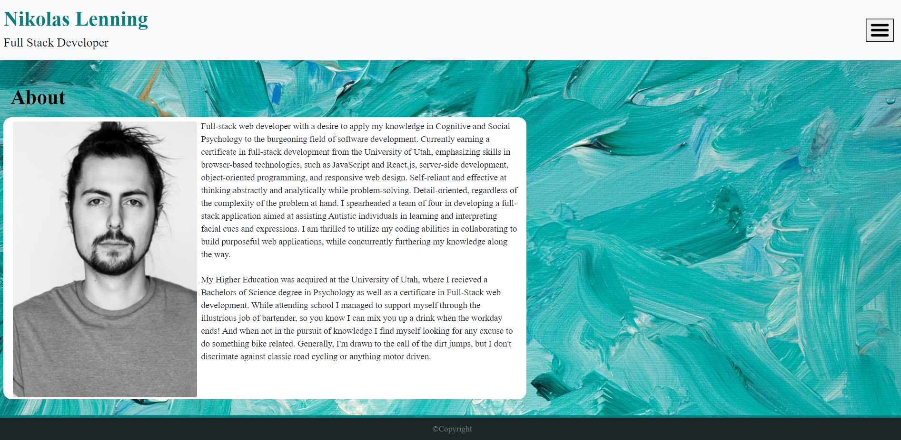

# React Portfolio

React portfolio is a heroku app where I have created my own personal mobile responsive portfolio using React and React-Bootstrap to minimize the use of media queries. My page renders well on a variety of devices and screen sizes, this is accomplished through a responsive layouts. 

[React Bootstrap CSS Framework](https://react-bootstrap.github.io/) was used.

A live link to my [Responsive Portfolio](https://obscure-bastion-50580.herokuapp.com/) is hosted on Heroku.

A link to my [React Portfolio](https://github.com/nikolaslenning/React-Portfolio) repository is hosted on Github.

This application was authored by [Nikolas Lenning](https://github.com/nikolaslenning).